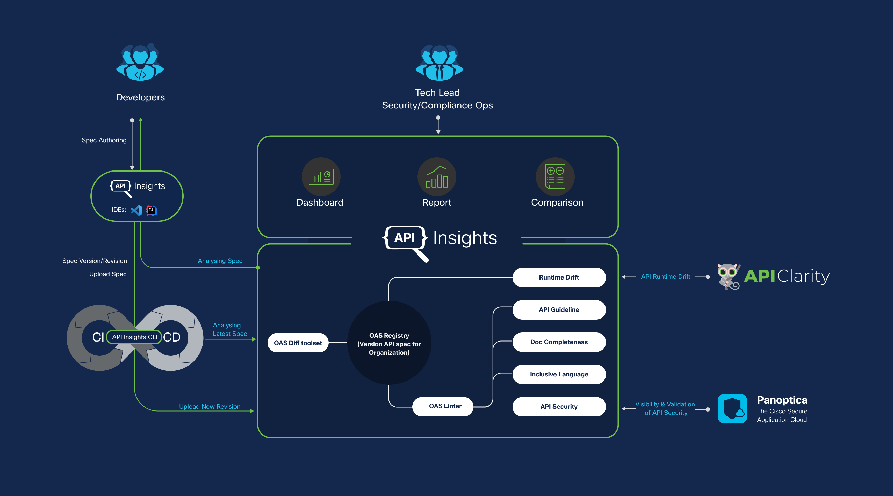

<seotitle>API Insights is an open-source tool to help developers improve API quality and security</seotitle>

# What is API Insights?

As APIs become increasingly important to many organizations, the importance of good API design also grows. APIs need to be secure, consistent, usable, and inclusive. New versions of an API might introduce breaking changes, which can increase development time and accumulate technical debt.

**API Insights** helps you improve your API quality by analyzing and scoring your Swagger 2.0 or OpenAPI 3.x specification (spec) files. API Insights can perform its static analysis in your GitHub CI/CD pipeline, on your local machine through a CLI, or in Visual Studio Code as an IDE extension. API Insights also provides a browser-based dashboard, which catalogs and tracks your APIs, their versions, and their analysis scores.

API Insights runs several analyzers to assess and score API spec files on the following dimensions:

* **Adherence to OpenAPI Guidelines** promotes consistency across our APIs and promotes good design practices.
* **Documentation Completeness** means that an API contains descriptions and examples for its components, so that the API can be adopted and used efficiently and effectively.
* **Inclusive language** helps ensure that our terminology is free of offensive or exclusionary language.
* **Security** is extremely important for any API. Over 90% of organizations that use APIs had a security incident in the last year.

You can also generate API changelogs to help your API consumers and developers understand how your API changes from version to version. This allows you to assess backwards compatibility and breaking changes before they reach production.

## Why Validate and Score OpenAPI Specification Files?

As the number of services increases in an organization, teams need a common place to store their versioned API spec files. API Insights service stores multiple versions of both released and release-candidate API specifications, and generates difference reports across multiple versions and revisions of your spec files.

Teams also need to work collaboratively on spec files in GitHub or other version control systems. The API Insights CLI allows you to integrate the spec file analyzers into a CICD or local commit pipleline. 

When working across multiple teams, developers can end up with inconsistent API specifications. Inconsistencies make it difficult for API consumers to integrate services across multiple APIs. API Insights allows you to validate and score an API spec file against specific API guidelines. 

In addition, if API changes are not backwards compatible with previous versions, your organization can lose the trust of your developers and consumers. Use API Insights to identify and get alerts on changes that are not backward-compatibility compliant.

Developers often lament another common issue: a lack of consistent documentation of API changes across multiple releases. With API Insights, you can look for API document completeness. The tool provides a best practices check to ensure complete docs from any generated documentation from the spec file.

## What Works With API Insights?

API Insights leverages [API Clarity](https://apiclarity.io) to analyze API drift. This allows API Insights to identify Zombie and Shadow APIs on currently-running services. A Zombie API is an API that has been deprecated and should no longer be be running on the service. A Shadow API is an API path that is not documented, but is still working on a service. Either of these can pose security and backwards compatibility risks.

## How Does API Insights Work? 

API Insights stores its analysis information and reports remotely and presents its data through a browser-based dashboard. From the API Insights dashboard, you can view analysis scores and reports, download specific versions of spec files, see diff reports, and more. You can analyze a spec file by committing it to a GitHub repository which has been configured to run API Insights in its CI/CD pipeline, through the API Insights dashboard UI, or through the **local CLI**.

A typical API Insights workflow might look something like the following:

1. Author your API spec file locally.
1. Use either the [API Insights extension](../guides/vscode-extension.md) for Visual Studio Code or the [API Insights local CLI](../references/clidocs/api-insights-cli.md) to analyze your spec file. Both of these options allow you to analyze a local spec file and view analysis information from the API Insights remote service. Iterate on your local spec file to raise its scores before you commit it to your repository.
1. Commit your spec file to a GitHub repository which has been configured to run [API Insights in a CI/CD pipeline](../guides/cicd-setup-guide.md). Create a GitHub release tag to trigger the API Insights analyzers and differentiate the new version of the spec file from previous versions. API Insights runs its analyzers on your spec file as GitHub actions, and passes the results into the API Insights dashboard. You can also analyze a spec file in the following ways:
   1. Upload your spec file directly to the API Insights dashboard UI.
   1. Run the local API Insights CLI to analyze the spec file in your local environment.
   1. Use the API Insights Extension for Visual Studio Code to run the API Insights analyzers in your local IDE.
1. If you uploaded your spec file to the API Insights remote service, check the **API Insights dashboard** to view your recently-submitted spec file's scores, reports, diff comparisons, and more. The dashboard tracks multiple API spec files and versions of those spec files, so you can quickly view reports and analyses for several products or services. Here you can see detailed line-by-line analysis of your spec files, including severity ratings and remediation recommendations. 
1. Iterate on your published spec file by cloning the spec file from the GitHub repository to your local environment and repeating steps 2 and 3 to raise your API's scores.
